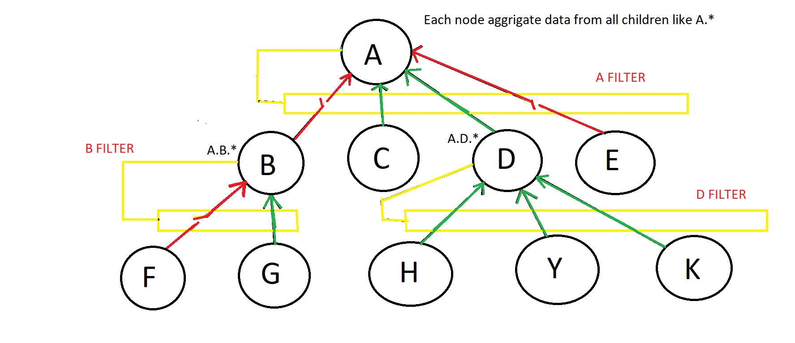

#Stream Router Service

##This dataflow realized abstract referral system.

Implementation of [NATS subjects] (MQ Publisher-Subscriber model) data waterfall as described on the image. 

The nodes of unary tree is a NATS subject wired with user input (Producers).
Data always move from child to parent nodes with possibility filtering first level children individually. 

[NATS subjects]:https://docs.nats.io/nats-concepts/subjects